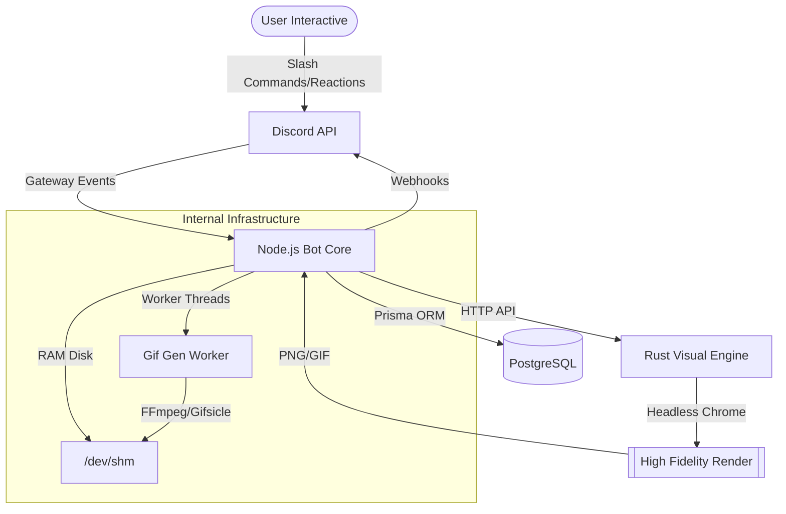

# 🤖 Ryan Bot v7: The Ultimate Handbook

**Ryan** is a premium, high-performance Discord engagement ecosystem. Designed for massive communities, it leverages a hybrid architecture—combining a robust **Node.js** enterprise core with a high-fidelity **Rust** rendering engine. 

Ryan doesn't just manage a server; it creates a living, breathing world through gamified moderation, faction warfare, and optimized engagement tracking.

---

## 🏛️ System Architecture

Ryan is built for speed and reliability, separating logic from heavy visual processing.



### 🚅 Technical Achievements
*   **Hybrid Engine**: Uses `axum` (Rust) to handle heavy headless browser rendering for rank cards, offloading CPU-intensive work from the Node.js event loop.
*   **RAM Disk I/O**: Temporary files (GIF frames, icons) are processed in `/dev/shm` (Linux RAM Disk), offering nanosecond latency compared to standard SSD writes.
*   **3-Phase Validation**: A high-speed caching layer ensures that even during chat floods, role rewards are verified in RAM before every hitting the Discord API.
*   **Worker Thread Isolation**: GIF generation is handled by dedicated worker threads to prevent bot latency during heavy rendering jobs.

---

## 📈 The XP Engagement Core

Ryan's XP system is engineered to prioritize quality engagement and prevent bot-farming.

### 🧠 Smart Scoring Logic
| Content Type | XP Reward | Rationale |
| :--- | :--- | :--- |
| **Alpha Characters** | 1 XP Each | Rewards text depth, ignores numbers/punctuation spam. |
| **Emojis (Any)** | 2 XP Each | Encourages expressive reactions and custom server emoji use. |
| **URLs** | 0 XP | Negates link spam and automated bot activity. |

### 🛠️ XP Management Systems
*   **Reset Modules**: Configurable via `/setup`.
    *   **Module 1 (Default)**: Daily XP resets every 24 hours. Ideal for highly active "Day Winner" competitions.
    *   **Module 2 (Weekly)**: Daily XP is persistent, with a full wipe once a week (Syncing to Clan Wars).
    *   **Module 3 (Lifetime)**: Total XP accumulation with no resets.
*   **3-Phase Role Rewards**:
    1.  **Phase 1 (RAM)**: Check incoming message user against a cached reward map.
    2.  **Phase 2 (Verification)**: If a milestone is hit, fetch fresh member data to prevent duplicate awards.
    3.  **Phase 3 (Execution)**: Grant role and send a rich announcement with a custom-generated level-up card.

---

## ⚔️ Clan Wars Conquest

A fully automated, 4-faction competitive system.

*   **Dynamic Visuals (`/clans`)**: Generates a real-time GIF combining server-customized clan icons with high-octane animated backgrounds.
*   **Automated Sync**: Every day, user XP is "poured" into their clan's total pool.
*   **Destruction Metrics**: Progress bars calculate "Destruction Inflicted" as a percentage of the total server engagement.
*   **Persistent GIF Pipeline**: Uses a message-link hashing system. If a leaderboard state hasn't changed, Ryan fetches the pre-generated GIF from a secure asset channel rather than re-rendering, saving CPU cycles.

---

## ⛓️ The Torture Chamber (Moderation)

A replacement for boring bans, creating an immersive "Prison" experience.

### 🔨 The Strike Table
| Strike | Duration | Effect |
| :--- | :--- | :--- |
| **1st Sin** | 30 Minutes | Silent Mute |
| **2nd Sin** | 1 Hour | Added to Prisoners Role |
| **3rd Sin** | 12 Hours | Prisoners Role + Jail Channel Access |
| **4th Sin** | 36 Hours | Isolation |
| **5th Sin** | 7 Days | Extended Isolation |
| **6th Sin** | 2 Weeks | - |
| **7th Sin** | 4 Weeks | Final Warning |
| **8th Sin** | **Permanent** | Server Ban |

### 🎭 Prisoner Immersion
*   **Mugshot Generation**: Automatically creates "Caught" GIFs using the user's avatar.
*   **Torture Chamber Channel**: A restricted channel where jailed users are taunted by the bot's "Flavor Text."
*   **Community Redemption**: Mods can enable **Vote to Release**, allowing server members to contribute votes to shorten a prisoner's sentence.

---

## 📜 Full Command Reference

### Admin & Owner (Config)
| Command | Sub-Command | Description |
| :--- | :--- | :--- |
| `/setup` | - | Configure Channels (Mod Log, Leaderboard) and Roles (Admin, Mod, Jail, Clans). |
| `/setup_role_rewards` | - | Interactive Wizard to map XP milestones to roles, messages, and icons. |
| `/keyword` | `set` \| `remove` \| `list` | Map chat triggers to automatic emoji reactions. |
| `/setup-clan-icon` | - | Upload custom emojis or images for Clan representation. |
| `/resetrole_system` | `reset` \| `readd` \| `list` | Advanced role-stripper for server events/resets (w/ 15m restore window). |
| `/skip_cycle` | - | Force the XP reset clock forward (Owner only). |

### General & Social
| Command | Description |
| :--- | :--- |
| `/rank` | Fetch your high-resolution PNG rank card showing daily/weekly/lifetime stats. |
| `/live` | View the top 10 "Yappers" list now. Includes "Show My Rank" button highlight. |
| `/clans` | Open the Clan Wars dashboard with the dynamic GIF state. |
| `/custom_role` | `request`: Request a custom color and name (requires eligibility role). |
| `/hi` | Advanced system heartbeat (Latency, DB Health, Shard Info, Uptime). |
| `/help` | Detailed interactive help menu. |
| `/reconnect` | Emergency force-restart of the Rust Visual Engine. |

---

## 🛠️ Developer Guide

### Project Structure
```text
Ryan/
├── src/
│   ├── commands/     # Slash command logic (Admin/Config/Gen)
│   ├── services/     # Business logic (XP, Jail, Reset, Image Gen)
│   ├── handlers/     # Interaction, Reaction, and Message routing
│   ├── structures/   # Custom Discord Client extensions
│   ├── workers/      # Heavy processing (FFmpeg Gif Threads)
│   └── index.js      # Main entry & Cron Scheduler
├── Renderer/         # RUST: High-performance visual engine
│   └── src/          # Axum + Playwright/Chromiumoxide logic
├── assets/           # Templates, Fonts, and Local Icons
└── schema.prisma     # Postgres Database Schema
```

### Self-Healing & Maintenance
*   **Zombie Killer**: On startup, Ryan scans for and kills any orphaned Headless Chrome or Renderer instances from previous crashes.
*   **Graceful Exit**: On `SIGTERM` or `SIGINT`, Ryan properly closes DB connections and terminates the Rust process group to prevent port locks.
*   **DB Heartbeat**: Ryan performs an integrity check every 5 minutes and logs any latency spikes in PostgreSQL.

---

## 🚦 Getting Started

### 1. Environment Config
Rename `.env.example` to `.env` and fill:
*   `TOKEN`: Discord Bot Token
*   `CLIENT_ID`: Bot Application ID
*   `DATABASE_URL`: PostgreSQL Connection String

### 2. Deployment
```bash
# Install Node Deps
npm install

# Build the Rust Engine (Requires Rust/Cargo)
npm run setup

# Launch (Prisma syncs automatically)
npm start
```

---
*Created with ❤️ for the world's best communities. Powered by Node.js, Prisma, and the speed of Rust.*
