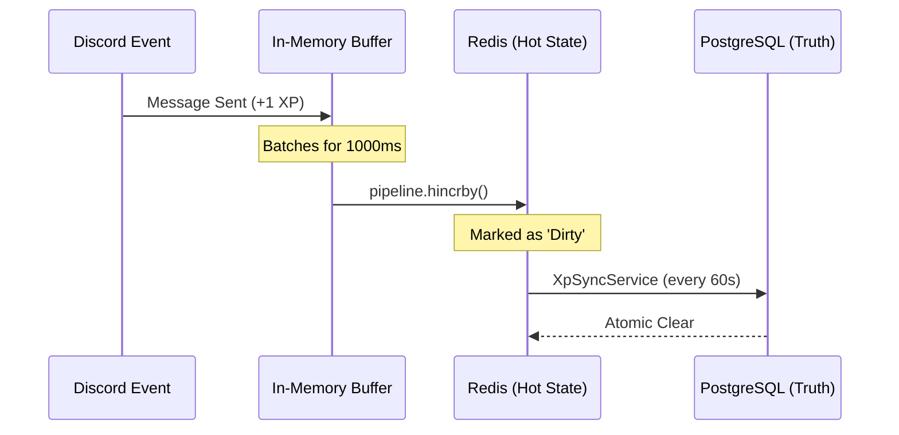
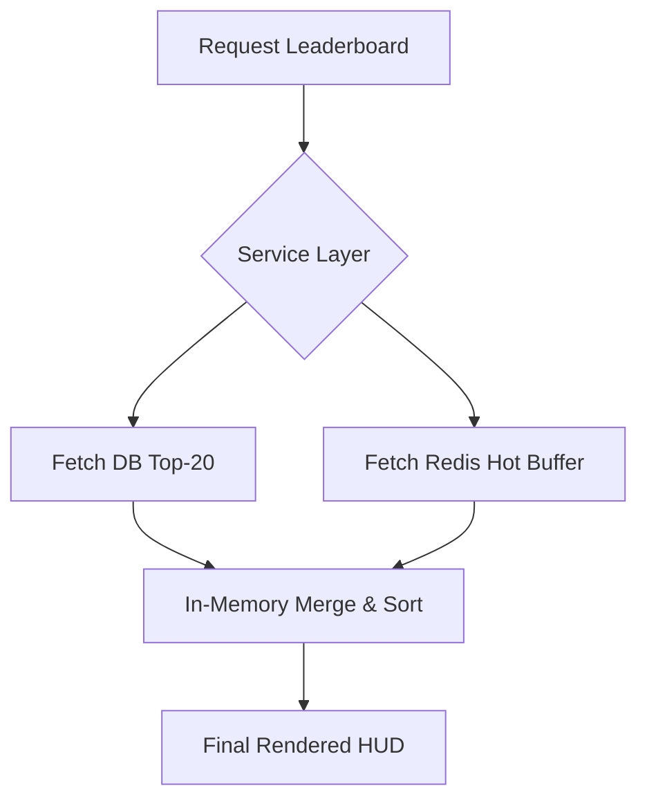

# 🤖 Ryan Bot v7: The Ultimate Handbook

**Ryan** is a premium, high-performance Discord engagement ecosystem. Designed for massive communities, it leverages a hybrid architecture—combining a robust **Node.js** enterprise core with a high-fidelity **Rust** rendering engine. 

Ryan doesn't just manage a server; it creates a living, breathing world through gamified moderation, faction warfare, and optimized engagement tracking.

---

## 🏛️ Technical Architecture: The 3-Layer Rule

To maintain 100% system reliability and developer clarity, Ryan enforces a strict 3-tier hierarchy. Any deviation from these boundaries is considered a critical architectural failure.

### Layer 1: Entrypoints (Interactions & Events)
- **Paths**: `src/handlers/`, `src/commands/`, `src/events/`
- **Responsibility**: Thin routers. They parse Discord `Interaction` or `Message` inputs, extract relevant data, and delegate to the Service Layer.
- **Constraint**: **Zero-Logic Zone.** No direct `prisma` calls or complex business math allowed here.

### Layer 2: The Service Layer (The Logic Core)
- **Paths**: `src/services/` (e.g., `XpService.js`, `PunishmentService.js`, `XpSyncService.js`)
- **Responsibility**: The brain of the bot. Handles XP calculations, leveling logic, jail timers, and role synchronization.
- **Integration**: Communicates with Redis for hot state and Prisma for long-term persistence.

### Layer 3: Data & Infrastructure
- **Persistence**: **PostgreSQL** via Prisma ORM for relational truth.
- **Hot Cache**: **Redis** for atomic increments (XP) and dirty-state markers.
- **Visuals**: **Rust/Axum** rendering microservice (`Renderer/`) for CPU-bound SVG-to-PNG operations.

---

## 🗺️ System Memory Map

| Component | Path | Description |
| :--- | :--- | :--- |
| **Interactions** | `src/handlers/` | Command & Component routing |
| **Logic** | `src/services/` | XP, Leaderboards, Punishments |
| **Visuals** | `Renderer/src/` | Rust high-performance rendering |
| **Persistence** | `schema.prisma` | DB schema & Prisma client |
| **Workers** | `src/workers/` | Background BullMQ jobs (Gifs, Sync) |
| **Lib** | `src/lib/` | Logger, Redis config, Prisma client |

---

## ⚡ Performance Deep-Dive: Scaling to 10k Servers

Ryan is engineered to handle extreme burst traffic without sacrificing responsiveness.

### 1. UDS Redis Connectivity
By default, the bot connects to Redis via **Unix Domain Sockets** (`/run/redis/redis-server.sock`). 
- **Benefit**: Bypasses the entire TCP/IP stack, reducing latency by ~30% and eliminating port exhaustion issues under high concurrency.

### 2. RAM Disk I/O (`/dev/shm`)
For high-frequency visual operations (e.g., rendering thousands of avatar frames or clan icons), Ryan utilizes the **Linux RAM Disk**.
- **Benefit**: Nanosecond write speeds and zero wear-and-tear on SSDs.

### 3. Micro-Batching XP Pipeline
XP gain is never written to the DB in real-time. Instead, it follows a high-efficiency flush cycle:
1. **In-Memory Buffer**: Messages are tallied in a Node.js `Map`.
2. **Redis Flush (1s)**: The buffer is piped to Redis using `HINCRBY`.
3. **Postgres Sync (60s)**: `XpSyncService` performs an atomic `RENAME` on the Redis key and executes a bulk Prisma transaction.

---

## 📊 Data Flow Visuals

### XP Synchronization Strategy

```mermaid
sequenceDiagram
    participant D as Discord Event
    participant B as In-Memory Buffer
    participant R as Redis (Hot State)
    participant P as PostgreSQL (Truth)

    D ->> B: Message Sent (+1 XP)
    Note over B: Batches for 1000ms
    B ->> R: pipeline.hincrby()
    Note over R: Marked as 'Dirty'
    R ->> P: XpSyncService (every 60s)
    P -->> R: Atomic Clear
```

### Live Leaderboard Merging (The Hybrid Query)
To show "Live" rankings, Ryan merges two data sources in real-time:

```mermaid
graph TD
    A[Request Leaderboard] --> B{Service Layer}
    B --> C[Fetch DB Top-20]
    B --> D[Fetch Redis Hot Buffer]
    C --> E[In-Memory Merge & Sort]
    D --> E
    E --> F[Final Rendered HUD]
```

---

## 📈 The XP Engine internals

### The Quadratic Progression
Ryan uses a cumulative quadratic model to ensure that leveling remains challenging and rewarding over time.
**`TotalXP(Level) = 119 * Level² + 298 * Level`**

- **Inversion**: `Level = floor((-298 + sqrt(298² + 4 * 119 * XP)) / 238)`
- **Progression**: The XP required to reach the next level increases linearly by **238** per level (starting from 417 for Level 1).

### Scoring Metrics
- **Alpha Characters**: 1 XP per character.
- **Emojis & Stickers**: 2 XP per item.
- **Anti-Spam**: XP is suppressed for jailed users or during specific cooldown windows.

---

## 🎨 Rust Rendering Engine (`Renderer/`)

A standalone service built in **Rust** designed to offload visual debt from the Node.js event loop.

### Advanced Rendering Features
- **Unicode Normalization**: Automatically standardizes mathematically styled names (e.g., 𝐆𝐎𝐊𝐔 → GOKU) to prevent font-width miscalculations.
- **Multi-Layer Font Fallback**:
  1. `Poppins-Bold` (Primary Branding)
  2. `DejaVu Sans` (Standard Unicode)
  3. `NotoSansMath` (Scientific/Fancy symbols)
  4. `Symbola` (Legacy Emoji/Symbols)
- **Tikv-Jemalloc**: Uses a low-fragmentation allocator for extreme long-term stability in high-memory environments.

---

## ⚔️ Clan Warfare: The Motion Compiler

The Clan Warfare system is a visual competition powered by a distributed GIF generation pipeline.

### The motion logic
Instead of static images, `gifWorker.js` uses a **Motion Compiler** to translate `coords.json` into complex FFmpeg mathematical expressions.
- **FFmpeg Math**: `[0:v][1:v]overlay=x='between(n,0,10)*100+between(n,11,20)*150':y=...`
- **Dynamic Visibility**: Clans only appear on the HUD during their specific "action frames" defined in the template.

---

## ⛓️ The Torture Chamber (Moderation)

A progressive, anti-toxic strike system that integrates directly with the XP engine.

### The 8-Tier Punishment Table
| Tier | Punishment | Duration | XP Gain? |
| :--- | :--- | :--- | :--- |
| **1-2** | Warning | Instant | ✅ |
| **3** | Short Jail | 30 Minutes | ❌ |
| **4** | Mid Jail | 2 Hours | ❌ |
| **5** | Long Jail | 12 Hours | ❌ |
| **6** | Heavy Jail | 1 Week | ❌ |
| **7** | Super Jail | 4 Weeks | ❌ |
| **8** | Execution | Permanent Ban | ❌ |

---

## 🗃️ Database Schema Overview

| Model | Purpose | Key Fields |
| :--- | :--- | :--- |
| `UserXp` | Multi-interval XP storage | `userId`, `guildId`, `dailyXp`, `weeklyXp`, `xp` |
| `GuildConfig` | JSON-driven configuration | `ids`, `config`, `clans`, `reactionRoles` |
| `JailLog` | Tracks criminal history | `offences`, `punishmentEnd`, `status`, `votes` |
| `ResetCycle` | Maintenance windows | `lastResetUtc`, `resetHour`, `resetMinute` |
| `GifCache` | Visual asset deduplication | `rankHash`, `messageLink` |

---

## 🛠️ Development & Deployment

### Build the Rust Renderer
```bash
cd Renderer
cargo build --release
./target/release/renderer
```

### Start the Bot (Production)
```bash
pm2 start ecosystem.config.js
pm2 logs
```

---

*Created with ❤️ for the world's best communities. Powered by Node.js, Prisma, and the speed of Rust.*
